# Success Rate of Genre Classification by Genre

DSC160 Data Science and the Arts - Midterm Project Repository - Spring 2020

Project Team Members: 
- Nathan Tsai, nhtsai@ucsd.edu
- Hanbyul Ryu, h9ryu@ucsd.edu
- Joseph Del Val, jdelval@ucsd.edu
- Jacob Benson, jtbenson@ucsd.edu

## Abstract

(10 points) 

This analysis seeks to expand upon the previous genre classification covered in class in broadening the scope to a greater number of genres and tracks, utilizing the diverse and vast resources available from the Spotify API. Using songs sampled from different genre playlists generated by Spotify, we seek to answer the question: which genres will be classified with the highest degree of accuracy? We hypothesize that genres considered intuitively unique by humans, such as Hip Hop and Classical, will be classified correctly most often. Spotify’s API will provide us with the features we will use for classification, such as energy, loudness, acousticness, and tempo. In addition to this, we will personally extract features from the sample audio including Time Series, Mel Frequencies, and MFCCs. In order to carry out our analysis to completion we will make use of librosa, pandas, and scikit-learn. We will use these two factors (the audio features and the sample audio) to develop a classifier and determine its accuracy by comparing the classified genre to the genre playlist the song was contained in.

While much of our analysis will lie in the exploratory data analysis and classification, we will also make use of visualization: both in visualizing the feature differences between genres during the exploratory stage, as well as visualizing the differences in classification accuracy in order to communicate our results. The significance of this analysis lies in its ability to highlight the particularly unique genres amid the music we listen to and in its use of Spotify— a popular music streaming service that is used by millions of listeners worldwide.

## Data

(10 points) 

Our cultural data source was a collection of playlists from the online music streaming service Spotify. The playlists in question were hand-crafted by Spotify in order to provide music to listeners who are seeking a specific genre.
From Spotify's API, we acquired information about the tracks contained on 18 different playlists.

#### Rock
90s Rock Anthems: https://open.spotify.com/playlist/37i9dQZF1DX1rVvRgjX59F?si=GqFfPLIFTayeACySPYQ3Rg  
80s Rock Anthems: https://open.spotify.com/playlist/37i9dQZF1DX1spT6G94GFC?si=8cA6oEgdS1ik6QY9o897ew  
00s Rock Anthems: https://open.spotify.com/playlist/37i9dQZF1DX3oM43CtKnRV?si=umHsbMXiR-WdwATVR8LcVA  
Rock Classics: https://open.spotify.com/playlist/37i9dQZF1DWXRqgorJj26U?si=uGZNvnwPQlWgrr6GhUXbHQ  
#### Classical
Classical Essentials: https://open.spotify.com/playlist/37i9dQZF1DWWEJlAGA9gs0?si=OqZq_LxFRIKruh9OoZa6SA  
Classical Reading: https://open.spotify.com/playlist/37i9dQZF1DWYkztttC1w38?si=39fZeozBTiKwD3ZzBHXw7w  
Classical Focus: https://open.spotify.com/playlist/37i9dQZF1DXd5zUwdn6lPb?si=GcoKHKNRROWY3jNk0Zz4rQ  
I Love My West Coast Classics: https://open.spotify.com/playlist/37i9dQZF1DX9sQDbOMReFI?si=ICj1Y695Qjm1PrMKZNJ7PQ  
#### Hiphop
I Love My '90s Hip Hop: https://open.spotify.com/playlist/37i9dQZF1DX186v583rmzp?si=d-69VQS2S5We01fPAJy2VA  
Get Turnt: https://open.spotify.com/playlist/37i9dQZF1DWY4xHQp97fN6?si=6eHGocEHSxisFo_WoeTDEQ  
#### Punk
Classic Punk: https://open.spotify.com/playlist/37i9dQZF1DX3LDIBRoaCDQ?si=G3vdAY5lRIuUTUHB7Osl1g  
Punk Essentials: https://open.spotify.com/playlist/37i9dQZF1DXd6tJtr4qeot?si=-swGdu91S56d9rccIrOABA  
New Punk Tracks: https://open.spotify.com/playlist/37i9dQZF1DX0KpeLFwA3tO?si=TwGXWilrSLKTrp-VoECasA  
#### Jazz
Jazz Classics: https://open.spotify.com/playlist/37i9dQZF1DXbITWG1ZJKYt?si=NVWfjjWQQ3uWmiGwjz5m_g  
Jazz Classics Blue Note Edition: https://open.spotify.com/playlist/37i9dQZF1DWTR4ZOXTfd9K?si=NpJY-SqhRXax4m7QiNb1Ag  
Late Night Jazz: https://open.spotify.com/playlist/37i9dQZF1DX4wta20PHgwo?si=-IQHHoQbSSuXRvJFR3HYgw  
Smooth Jazz: https://open.spotify.com/playlist/37i9dQZF1DXdwTUxmGKrdN?si=FPV6wJ-BTneKUIO6tRT9Vw  
Jazz X-Press: https://open.spotify.com/playlist/37i9dQZF1DX85XJl1mZAlp?si=OQYyVza3Qie0NCxJ7UNkKQ  

The music contained within these playlists spans centuries, ranging from Cello Suites by Johann Sebastian Bach, to Hip Hop music composed a few days ago. And, of course, the artists who created these songs are equally as varied. The playlists themselves are quite frequently updated by Spotify, and thus very recent cultural artifacts.  
As for the matter of whether or not it is a digital native, this too depends on which song is in question. Many of the classical and jazz pieces may be recordings of a recent performance of the song, whereas many of the modern tracks could possibly be digital releases from the beginning. 
It is from the heterogeny of this dataset that we seek to find underlying patterns and different characteristics of each of these genres. In finding these patters, we will eventually be able to classify one from the other, and from this find how near-- or far-- some of these genres are from one another.

In terms of the data values we are analyzing, each feature comes from one of two origins. 
One of these origins is Spotify's API itself. Spotify's API provides us with many of [its own analyses](https://developer.spotify.com/documentation/web-api/reference/tracks/get-audio-features/) of the song in question. These range from tempo or time signature, to how instrumental and how "danceable" the music is.
As for the other origin, we ourselves analyzed the 30 second samples provided to us by Spotify's API. From this 30 second sample, we extracted the time series, Mel frequencies, and MFCCs of each sample audio.

## Code

(20 points)

Data Acquisition: [link](code/Data%20Scraping.ipynb)  
Here, we made use of Spotify's API in order to retrieve information about the tracks contained inside 18 different playlists. These were then put into pandas dataframes and saved as CSV files.

Feature Extraction / Data Processing: [link](code/Data%20Processing.ipynb)  
Here, we made use of librosa in order to extract features from Spotify's 30 second sample audio, adding these features to the pandas dataframes from the last section, and saving them as separate CSV files.

Exploratory Data Analysis: [link](code/EDA.ipynb)  
Here, we combined the each of the genres' data into a [combined dataframe](./data/combined.csv) used Pandas and Matplotlib to explore the data we had collected. We explored how the main Spotify features differed for each genre to get a better sense of the data we were working with.

Classification / Results Generation: [link](code/Classification.ipynb)  
Here, we trained a Naives Bayes classifier on the combined dataframe, eventually achieving an accuracy of 0.773333. Following this, we used Matplotlib to create charts of our results detailing the predictions of the classifier.

## Results

(30 points) 

#### Exploratory Data Analysis

Focusing on the features provided for each track by Spotify, we took a look at how the features differed by genre by using Matplotlib to create some simple visualizations.

<a href="./results/meanfeatures.png">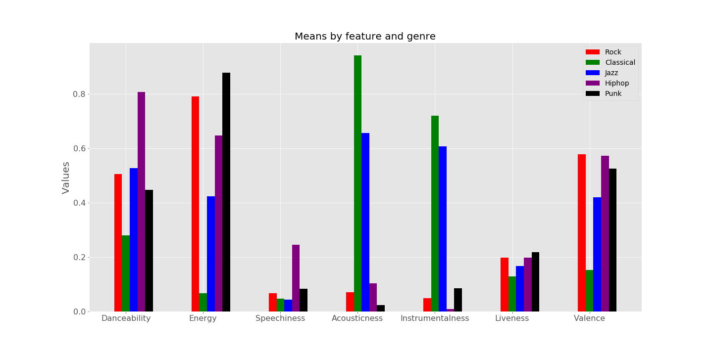</a>

The bar plot shows the mean of certain <a href="https://developer.spotify.com/documentation/web-api/reference/tracks/get-audio-features/">Spotify features</a> for each genre. We can see that some genres have larger values of a feature on average, which will be good distinctions when training the genre classifier. For example, we can see that hiphop music is higher in 'speechiness' and 'danceability', jazz and classical music are higher in 'acousticness' and 'instrumentalness', and rock and punk music are higher in 'energy' and 'liveness'.

 
 

<table>
    <tr>
        <th>Correlation Matrix</th>
        <th>Brief Description of Results</th>
    </tr>
    <tr>
        <td><a href="./results/corr_rock.png">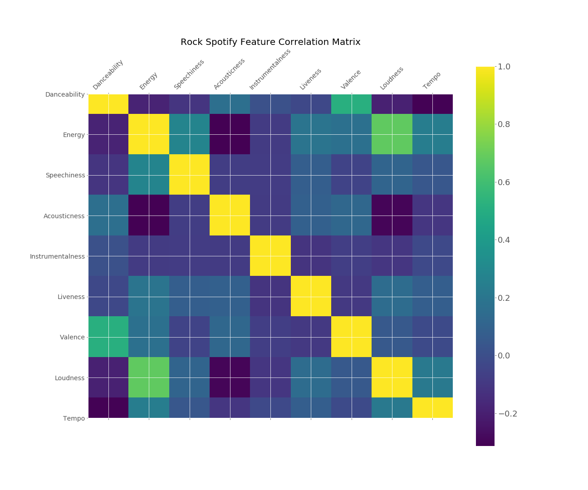</a></td>
        <td>Rock music has stronger correlations between 'danceability' and 'valence' and between 'loudness' and 'energy'. Rock music also has weak correlations between 'energy' and 'acousticness' and between 'danceability' and 'tempo'.</td>
    </tr>
    <tr>
        <td><a href="./results/corr_classical.png">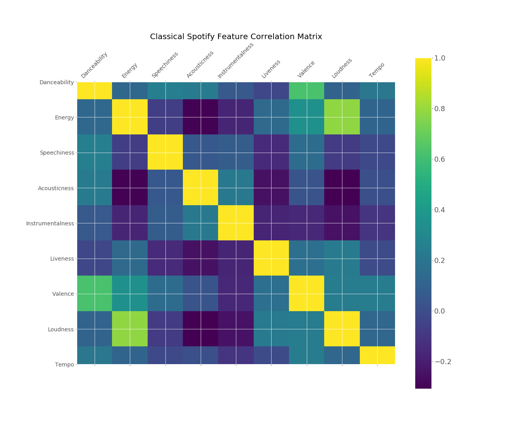</a></td>
        <td>Classical music has stronger correlations between 'valence' and 'danceability' and between 'energy' and 'loudness'. Classical music also has weak correlations between 'energy' and 'acousticness' and between 'acousticness' and 'loudness'.</td>
    </tr>
    <tr>
        <td><a href="./results/corr_jazz.png">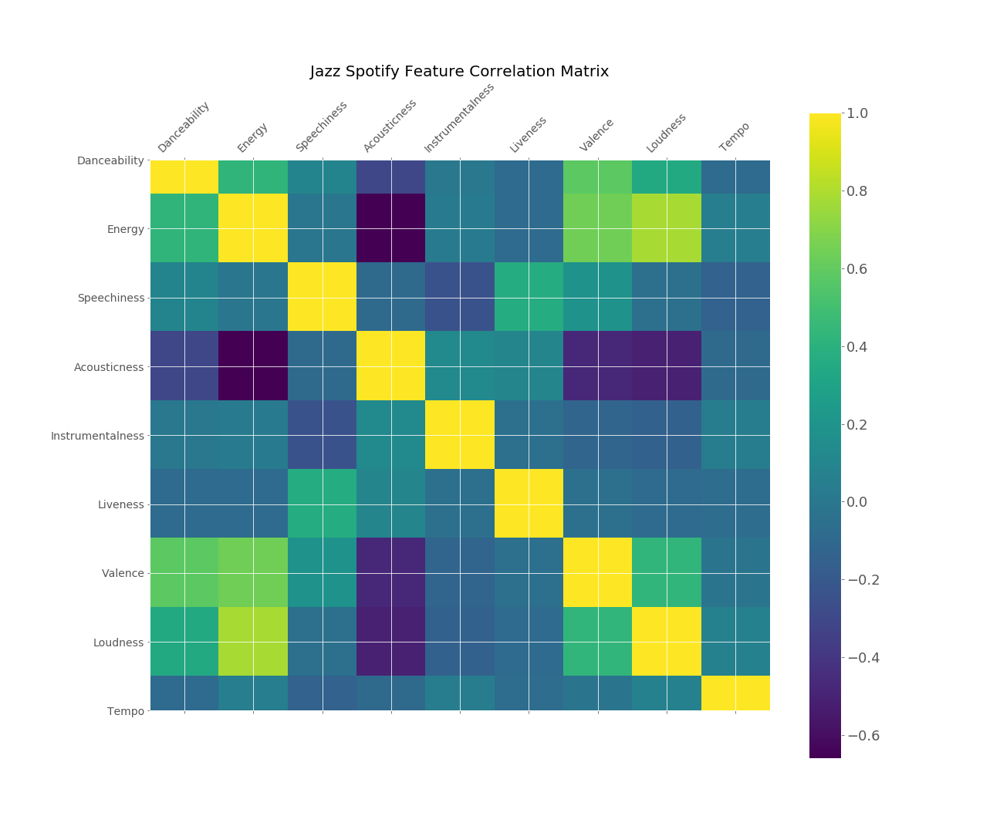</a></td>
        <td>Jazz music has stronger correlations between 'loudness' and 'energy' and between 'valence' and 'energy'. Jazz music also has weak correlations between 'acousticness' and 'energy' and between 'loudness' and 'acousticness'.</td>
    </tr>
    <tr>
        <td><a href="./results/corr_hiphop.png">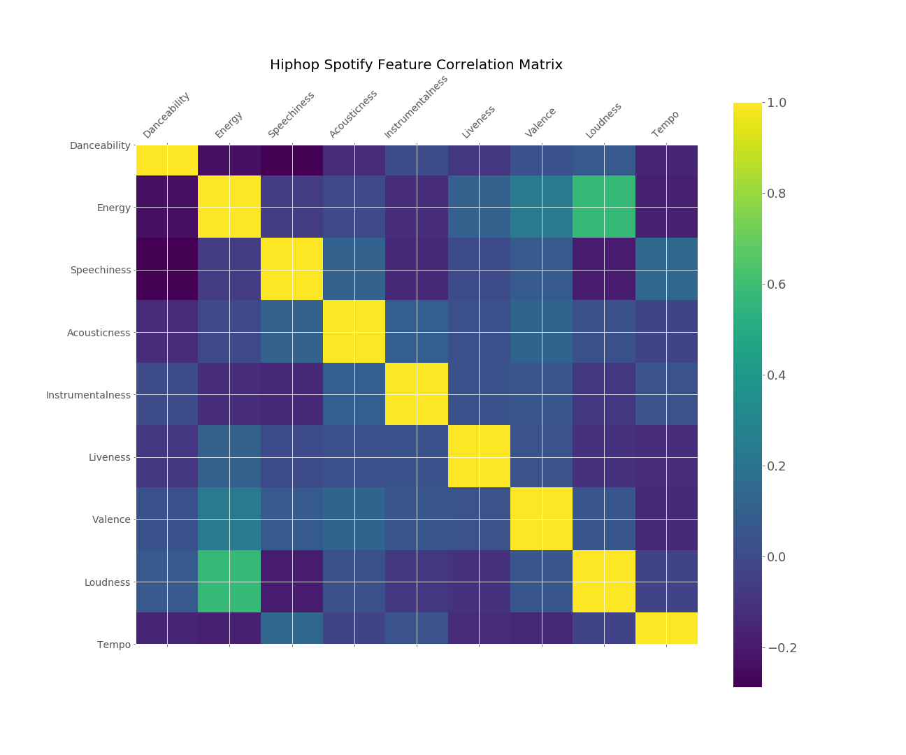</a></td>
        <td>Hiphop music has stronger correlations between 'loudness' and 'energy'. Hiphop music also has weak correlations between 'speechiness' and 'danceability' and between 'tempo' and 'energy'.</td>
    </tr>
    <tr>
        <td><a href="./results/corr_punk.png">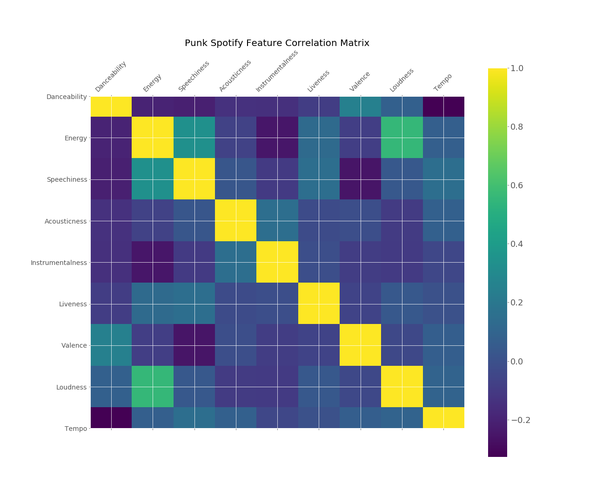</a></td>
        <td>Punk music has stronger correlations between 'loudness' and 'energy' and between 'speechiness' and 'energy'. Punk music also has weak correlations between 'danceability' and 'tempo' and between 'speechiness' and 'valence'.</td>
    </tr>
</table>

Following this, we trained a Naive Bayes classifier on this data in an effort to predict the genre. The classifier had an overall accuracy of 0.773333.

The results of the classifier are as follows.

<table>
    <tr>
        <th>Classification Pie Chart</th>
        <th>Brief Description of Results</th>
    </tr>
    <tr>
        <td><a href="./results/rock_preds.png">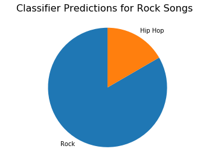</a></td>
        <td>Here, we found that rock songs were actually classified relatively well by the classifier, only occasionally being mistaken for hip hop. This could be seen as quite counterintuitive, as rock music can be thought of as similar to many other genres, such as punk. Nevertheless, our classifier did quite a good job at identifier rock music.</td>
    </tr>
    <tr>
        <td><a href="./results/classical_preds.png">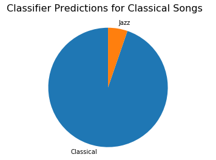</a></td>
        <td>Our classifier was, by far, most successful at recognizing classical music. One could then argue that Classical music is the most distinct among the genres we analyzed, in having features that are significantly characteristic of Classical-- and only Classical.</td>
    </tr>
    <tr>
        <td><a href="./results/jazz_preds.png">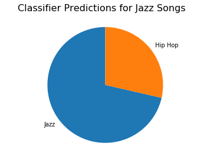</a></td>
        <td>Jazz suffered from the second-to-highest misclassification rate, and all of these misclassifications were with hip hop. This may also come at a surprise, given it can be seen as a particularly unique genre.</td>
    </tr>
    <tr>
        <td><a href="./results/hiphop_preds.png">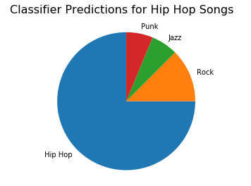</a></td>
        <td>Hip hop had an ordinary rate of misclassification by our classifier, and with three other genres. This seems quite natural, as hip hop frequently samples from several other genres, and is a particularly heterogenous genre in music.</td>
    </tr>
    <tr>
        <td><a href="./results/punk_preds.png">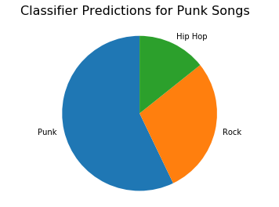</a></td>
        <td>Our classifier was by far the worst at recognizing punk music. It was misclassified nearly half the time as either rock or hip hop. One takeaway from this may be that punk music is extremely similar to rock and hip hop music from the features we analyzed, and isn't a particularly distinct genre in and of itself.</td>
    </tr>
</table>

## Discussion

(30 points, three to five paragraphs)

After training a Naive Bayes classifier on the Spotify features alone to train a genre classifier, we saw that the accuracy score was .69. By adding statistics derived from the MFCC audio features from each song's 30-second preview, our Naive Bayes genre classifier significantly improved its score by 7.9%.

Music is an integral part of life for many people around the world, contributing to various aspects, such as movies and tv shows. The way music is classified into genres itself is a cultural concept. By knowing the genre of a particular song, the listener is able to assume certain characteristics about it leading to whether they would like a song that they have not listened to yet. However, when it comes to music genres, the classification has always been more or less subjective and symbolic rather than set with a solid distinguishing factor. The traditional approach to genre classification is usually manual or predetermined by the artist, and therefore subjective, relying mostly on human distinguishing methods to determine genre per song. Therefore, this differs from our computational approach, which focuses on classifying the genre based on set audio features and a sample audio file. By analyzing audio features such as acousticness, danceability, energy, etc., we hoped to provide a more objective way to classify genres. The inclusion of sample audio files in the process of this analysis allowed us to assimilate the traditional genre classification where the genre is determined by the way the song sounds.

Musicians are constantly innovating and changing their styles of music, so genres are inherently difficult to classify. Many genres overlap and represent a subjective view of a song’s features. The original musicians would most likely not want their music to be confined into one genre and would understand that the music itself has more meaning than quantifiable ‘danceability’ or ‘liveness’ qualities for example. By seeing how their music can be classified, musicians would likely be inspired to explore other genres of music, seeking a greater understanding of what aspects of their music defines a genre. The idea of genre classification raises questions as to what objectively can be said to define a specific music genre and where one genre ends and another begins. 

Ideally we’d like to expand the range of genres being classified to more than just the five we used. However, we ran into issues when trying to process an already copious amount of MFCC data, despite that data being collected on song previews. It became an issue of time and processing power, since the computers we were running our classifications on were taking so long to make use of the MFCC data. If possible we would have liked a broader range of MFCCs instead of having to settle for the mean and standard deviation. Another question we had while doing this project was how a purely Spotify features-based classifier would compare to using the full MFCCs of each song. This would give us an even better idea as to how helpful the provided features are in classifying genres. The simple mean and standard deviation we used already improved the classifier significantly— analyzing the full range of MFCC and Mel Frequency values may improve such a classifier considerably.

## Team Roles

Joseph: abstract, data scraping and processing, classification, and discussion
Nathan: abstract, EDA, and discussion
Jacob: abstract, classification and discussion
Hanbyul: abstract and discussion

## Technical Notes and Dependencies

This work makes use of the packages Numpy, Pandas, Scikit-learn, Librosa, Spotipy, and Matplotlib, which must be available.

Moreover, since we made use of the Spotify API, our API key was accessed via environmental variables in order to avoid pushing the key to github. This should be taken into account when attempting to replicate our work.

Lastly, at one point we created a .pikl file in order to transfer our data. This aforementioned .pikl  file had an incomprehensible amount of data saved into arrays, and as a result the file was over two gigabytes large. This may prove inconvenient when trying to replicate our work, as we were not allowed to push this file to github.

## Reference

Max, Tingle. Getting Started with Spotify’s API & Spotipy  
https://medium.com/@maxtingle/getting-started-with-spotifys-api-spotipy-197c3dc6353b  
Spotify API documentation  
https://developer.spotify.com/documentation/

